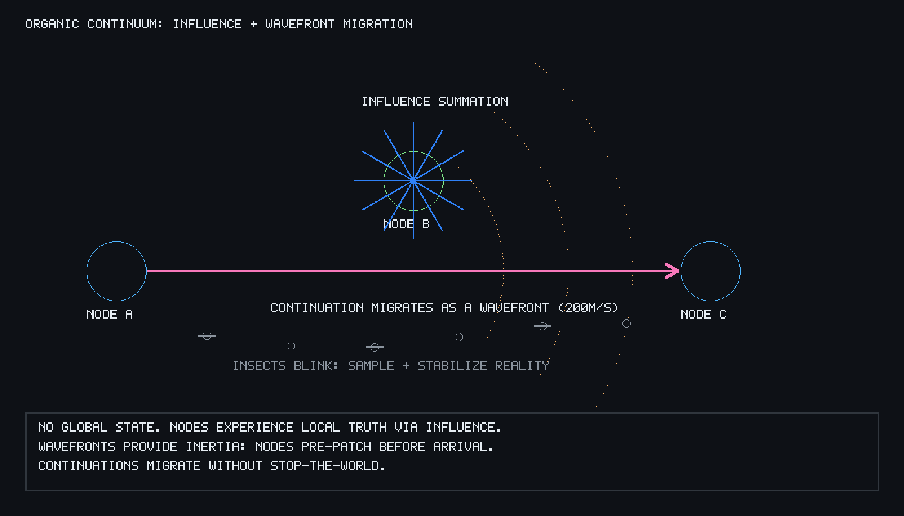

# The Organic Continuum
## A Relativistic Treatise On Information Physics And Autopoietic Systems
**By Christian Schladetsch**

---

### I. The Crisis Of The Mechanistic Worldview

For fifty years, distributed computing has been built upon a lie. That lie is the "Global State": the belief that a network of machines can, or should, share a singular, synchronized reality. This is the Mechanistic Worldview. It views the computer as a clockwork engine where every gear must mesh perfectly with its neighbor. If one gear slips (latency) or breaks (packet loss), the entire engine grinds to a halt or, worse, enters a state of "desynchronization."

To combat this, we have layered complexity upon complexity. We invented Paxos and Raft to force consensus. We invented NTP to chase the ghost of a universal "Now." We invented distributed locks to freeze the universe so we could safely measure it. These are not solutions; they are survival mechanisms for a flawed philosophy. They fight the fundamental physics of our universe: Relativity.

The universe does not have a global clock. As Einstein demonstrated, simultaneity is a function of the observer’s frame of reference. The Organic Continuum is the first architectural paradigm to accept this. It discards the "Clockwork Engine" in favor of the "Biological Forest." It is a system built not on the hope of synchronization, but on the certainty of perspective.

---

### II. Sub-Sonic Physics: The Density Of Truth

In a standard network, we attempt to move data at the speed of light. To the software, this creates a "Step Function"—an object is at Position A, and then it is instantly at Position B. This instantaneous jump is the source of all jitter. It is a "sonic boom" in the data-space that creates ripples of instability.

In the Organic Continuum, we redefine the speed of light within the system to a constant **200m/s**. This is the Sub-Sonic Constant. By capping the propagation of information at the speed of a fast car rather than a photon, we transform the network into a physical medium with density and resistance.

When an event occurs at Node A, it does not "update" Node B. Instead, it generates a **Wavefront**. This wave travels through the network fabric at 200m/s. Because the wave has a physical velocity, it provides the system with **Inertia**. A distant node sees the "influence" of an event approaching before the event actually arrives. This gives the local machine the most precious resource in computing: time to prepare. It allows for "Phase Stability," where the transition of state is handled as a curve rather than a jagged edge.

---

### III. The Insect Layer: The Quantization Of Reality

If Sub-Sonic Physics provides the space, the "Insects" provide the time. The Insects are autonomous, ubiquitous sampling agents that reside in every coordinate of the continuum. They are the "white blood cells" of the architecture.

In a Mechanistic system, we "stream" data - a constant, exhausting firehose of updates. The Organic Continuum does not stream; it **Samples**. Every $N$ milliseconds, an insect "blinks." It looks at its local environment, collapses the infinite complexity of the surrounding influence waves into a single, stable snapshot, and records it.

This is the "Blink" principle. It introduces a natural **Hysteresis** to reality. If a variable flickers between True and False a thousand times between blinks, the rest of the world never sees the flicker. The noise is filtered out by the very act of observation. 

Furthermore, the rate at which an insect blinks is governed by **Saliency**. If a player is standing next to an object, the insects in that area blink at 60Hz. If no one is watching, the insects fall into a "torpor," blinking once every minute or even once an hour. This is autopoietic scaling: the system only allocates the "energy" of computation to the areas of the world that are currently being observed. We do not solve the riddle of the tree falling in the woods; we simply refuse to blink until someone is there to hear it.

---

### IV. The Mathematics Of Influence And The Flocking Model

In the absence of a central server (the "Dictator"), how is order maintained? We look to nature. Birds do not vote on which way to fly; they follow a **Flocking Model**. In the Organic Continuum, consensus is replaced by the **Summation of Influence**.

Every node in the flock possesses an **Influence Weight**. When Node A receives data from Node B, it does not "accept" it as truth. It calculates the "Influence Delta" based on the inverse square law and temporal decay. 

Truth in this system is defined as:
$$W_{influence} = \frac{W_{source}}{1 + \text{dist}^2} \times e^{-\lambda t}$$

Where $W_{source}$ is the historical reputation of the sender, $dist$ is the sub-sonic distance, and $e^{-\lambda t}$ is the entropy of the message over time. If a "Rogue Bird" (a buggy node or a malicious actor) begins reporting false data, its influence does not cause a crash. Instead, the surrounding flock detects the "deviation" from the local average. The rogue node’s reputation weight ($W_{source}$) is statistically decayed until its influence reaches zero. The system does not banish the liar; it simply stops listening.

---

### V. Distributed Continuations: The Migration Of Souls

The ultimate test of the Organic Continuum is the movement of a "Live" execution—a Continuation—from one machine to another without stopping the world.

In a traditional system, this is a "Stop-the-World" event. In the Continuum, the Continuation is treated as a **Ghost State**. As the Continuation moves toward a new host, it travels as a 200m/s wavefront. As this wave passes through intermediate nodes, the "Insects" along the path record its passage. They update their local directional vectors, creating a "pheromone trail" in the network.

By the time the Continuation arrives at its destination, the "neighbors" of that machine already feel its presence. They have already "pre-patched" their pointers because they saw the ghost coming. The "soul" of the process doesn't jump; it flows.

---

### VI. The Tri-Color Ecosystem: Energetic Reclamation

Garbage collection in the Continuum is not a "cleanup process." It is an **Emergent Grazing Behavior**. Using a distributed Tri-Color marking system, we treat memory like an ecosystem.

* **White (The Void):** Objects that have not been "blinked" by an insect for a long period. They are functionally dead.
* **Grey (The Active):** Objects currently within the light-cone of a salient observer.
* **Black (The Solid):** Objects with high influence weights that form the "ground" of the current reality.

Because the Garbage Collector travels at the same 200m/s speed as the data, the "Marking Front" can never be outrun by the "Mutation Front." The janitor and the resident move at the same speed, ensuring that a "flying reference" is never accidentally deleted.

---

### VII. Conclusion: The Zen Of The Insect

The Organic Continuum is more than an architecture; it is a way of being for the machine. It is a recognition that the only way to build systems of infinite scale and zero perceived latency is to stop trying to control the world and start trying to **simulate its soul**.

When the engineers of the old world ask about your "Consistency Model" or your "Global Locks," give them the only answer that matters:

**"The insects are blinking. The players are happy. The code is small. Reality is not 100% accurate; it is 100% influential."**

We have moved beyond the machine. We have built a biosphere.
